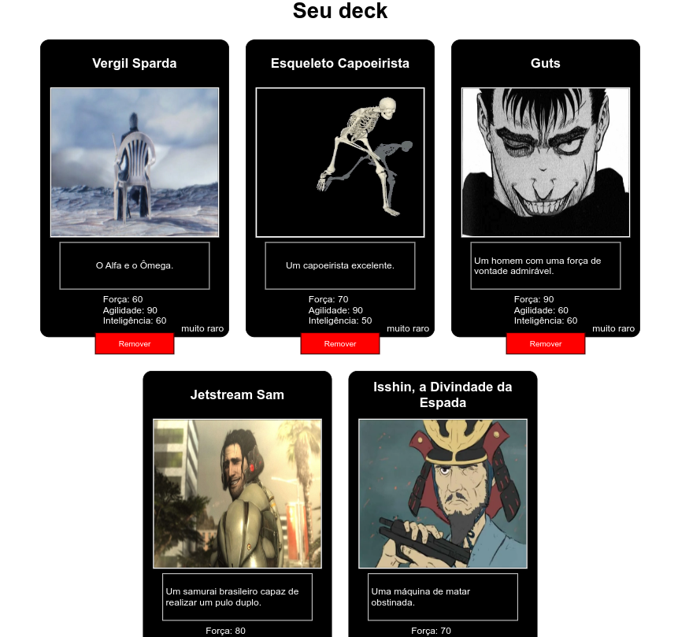

# Super Trunfos
É uma aplicação em que você pode criar a sua carta, inserindo nome, descrição, imagem, etc, e usa-lá no seu deck pra batalhar contra a maquina.

O jogo é completamente dependente da sorte, então, se você perder diversas vezes, não culpe o desenvolvedor

Eu fiz a aplicação de cabo a rabo, tirando a parte de configuração do lint.

## Regras do jogo
1. O seu deck só pode ter 5 cartas.
2. O seu deck pode ter cartas repetidas.
3. Você só pode ter uma carta super trunfo.
4. Uma carta super trunfo ganha de qualquer carta que não seja um super trunfo. Em caso de ambas as cartas serem super trunfos, é declarado empate.

## Gameplay
Pra jogar é so ter 5 cartas no deck e clicar em "Jogar".

Na parte de jogo, quando for a sua vez, é dada a opção de escolher um atributo que será usado na hora de comparar a carta. (Obviamente o recomendado é escolher o maior atributo)

Após a escolha, o atributo escolhido é comparado com o atributo da carta do oponente, quem tiver o maior ganha.

A parte de escolha e comparação de carta é repetida até as cartas do jogador serem 0.

Esse é o jogo, simples não?
## Link da aplicação
https://victormurilo23.github.io/super-trunfos/

## Exemplo de deck

